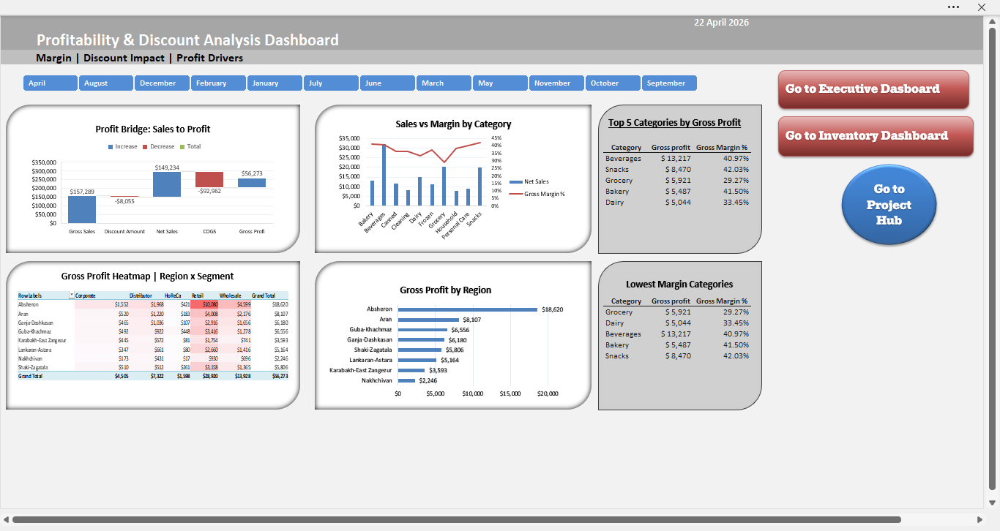

# Sales & Inventory Excel BI Project

An Excel-based BI project built with **Power Query**, **Data Model**, **Power Pivot**, and **DAX**.

## Project Overview

This project was designed to demonstrate that Excel can go far beyond basic spreadsheets when it is structured correctly.

Using a relatively small but well-organized sales and inventory dataset, I built an interactive BI solution with:

- Executive Dashboard
- Inventory Dashboard
- Profitability Dashboard

The focus of this project was not the size of the data, but the quality of the model, KPI logic, and dashboard design.

## Tools Used

- Microsoft Excel
- Power Query
- Data Model
- Power Pivot
- DAX
- PivotTables / PivotCharts
- Slicers / Interactive Filters

## Dataset Snapshot

- 220+ Products
- 700+ Customers
- 4,500+ Sales Records
- 3,200+ Inventory Movement Records
- 3 Interactive Dashboards

## Dashboards

### 1. Project Hub
A landing page with project summary, dashboard navigation, and project highlights.

### 2. Executive Dashboard
Provides a high-level business overview with KPI cards and performance visuals.

### 3. Inventory Dashboard
Focuses on stock position, movement analysis, and low stock / out of stock risk.

### 4. Profitability Dashboard
Shows gross profit, margin analysis, discount impact, and profitability drivers.

## Key Features

- Star schema-style data model
- Time intelligence with date dimension
- DAX-based KPI measures
- Inventory risk tracking
- Profitability and discount analysis
- Dashboard navigation and presentation layer

## Files

- [Excel Project File](project-files/Sales_Inventory_BI_Project.xlsx)
- [PDF Preview](pdf/sales_inventory_bi_project_preview.pdf)

## Notes

This project uses a relatively small dataset on purpose.  
The goal was to demonstrate Excel’s analytical and dashboard capabilities through correct modeling, KPI design, and structured reporting.

## Future Improvements

- Larger datasets
- More advanced business cases
- Expanded Power BI versions of similar projects
- GitHub Pages portfolio integration

## Author

Created by **Murshudlu Elchin**
