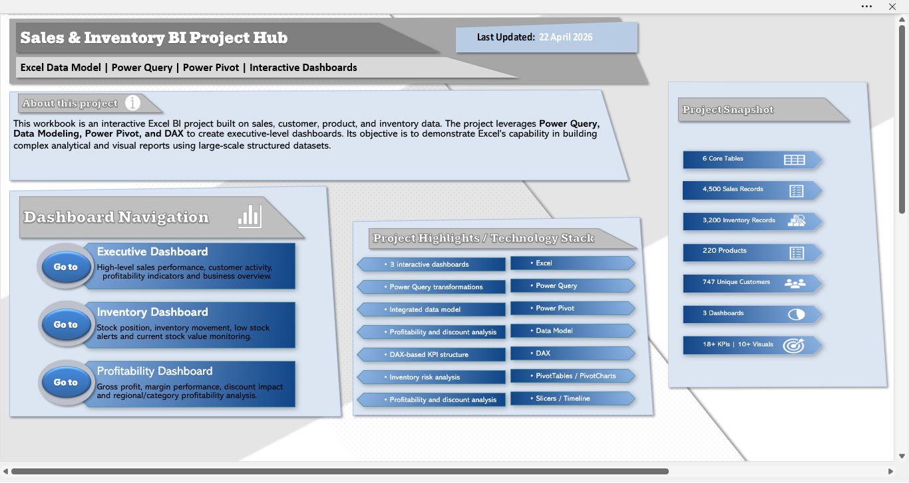
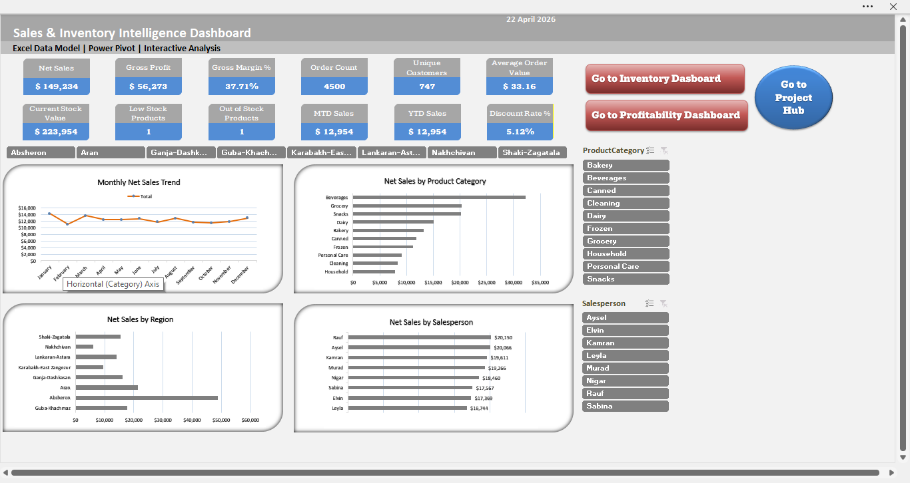
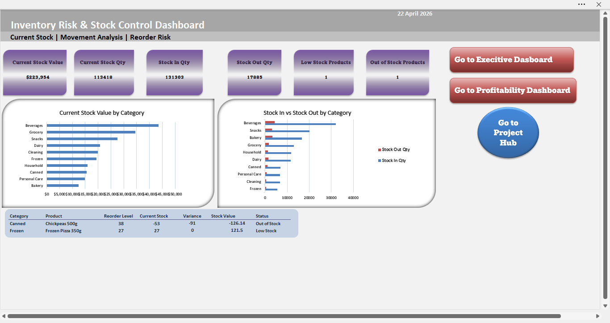
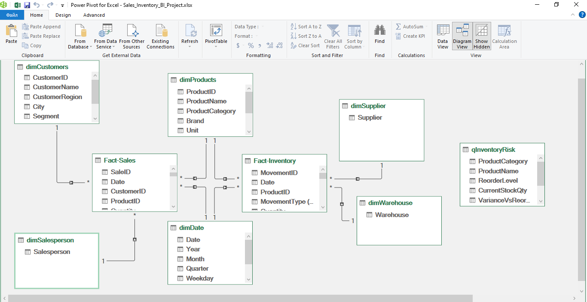
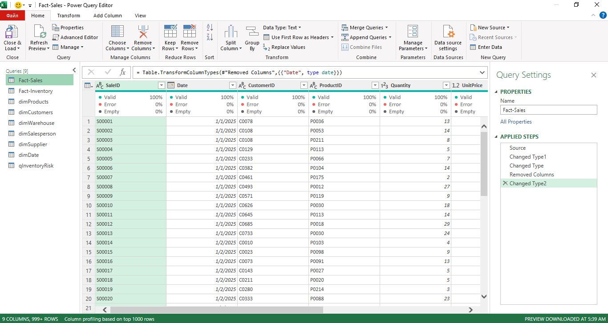
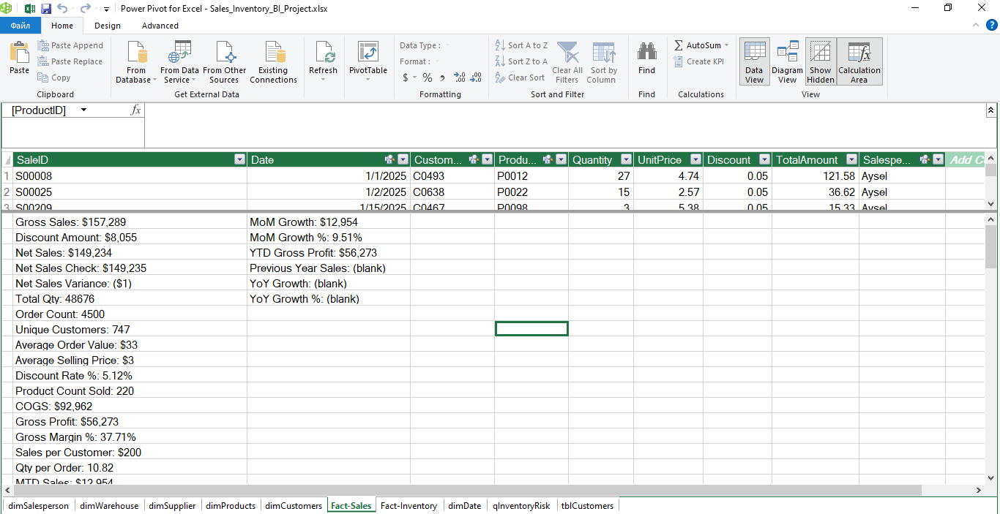
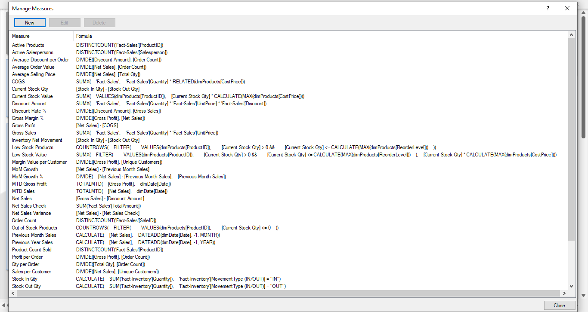

# Sales & Inventory Excel BI Project

An Excel-based BI project built with **Power Query**, **Data Model**, **Power Pivot**, and **DAX**.

## Project Overview

This project was designed to demonstrate that Excel can go far beyond basic spreadsheets when it is structured correctly.

Using a relatively small but well-organized sales and inventory dataset, I built an interactive BI solution with:

- Project Hub
- Executive Dashboard
- Inventory Dashboard
- Profitability Dashboard

The focus of this project was not the size of the data, but the quality of the model, KPI design, interaction logic, and dashboard presentation.

---

## Tools Used

- Microsoft Excel
- Power Query
- Data Model
- Power Pivot
- DAX
- PivotTables / PivotCharts
- Slicers
- Timeline
- Interactive Navigation Buttons

---

## Dataset Snapshot

- 220+ Products
- 700+ Customers
- 4,500+ Sales Records
- 3,200+ Inventory Movement Records
- 3 Interactive Dashboards

---

## Quick Demo

This project includes dashboard navigation buttons, slicers, timelines, and interactive chart behavior.

- [Watch Demo Video](demo-video/sales-inventory-demo.mp4)

### Demo Preview

---

## Final Dashboards

### 1. Project Hub
A landing page with project summary, dashboard navigation, and project highlights.

### 2. Executive Dashboard
Provides a high-level business overview with KPI cards and performance visuals.

### 3. Inventory Dashboard
Focuses on stock position, movement analysis, and low stock / out of stock risk.

### 4. Profitability Dashboard
Shows gross profit, margin analysis, discount impact, and profitability drivers.

---

## Behind the Dashboard

### Data Model Relationships
Star-schema style relationship model connecting fact and dimension tables.

### Power Query
Data preparation, shaping, and transformation steps used in the project.

### Power Pivot
Measure creation and model-based calculation layer.

### DAX Measure Library
Core KPI and analytical measures used across dashboards.

---

## Key Features

- Star schema-style data model
- Time intelligence with date dimension
- DAX-based KPI measures
- Inventory risk tracking
- Profitability and discount analysis
- Slicer and timeline interaction
- Dashboard navigation buttons
- Presentation-ready dashboard structure

---

## Files

- [Excel Project File](project-files/Sales_Inventory_BI_Project.xlsx)
- [PDF Preview](pdf/sales_inventory_bi_project_preview.pdf)
- [Demo Video](demo-video/sales-inventory-demo.mp4)

---

## Notes

This project uses a relatively small dataset on purpose.  
The goal was to demonstrate Excel’s analytical, modeling, and dashboard capabilities through correct structure and thoughtful design.

---

## Future Improvements

- Larger datasets
- More advanced business cases
- Expanded Power BI versions of similar projects
- GitHub Pages portfolio integration

---

## Author

Created by **Murshudlu Elchin**
